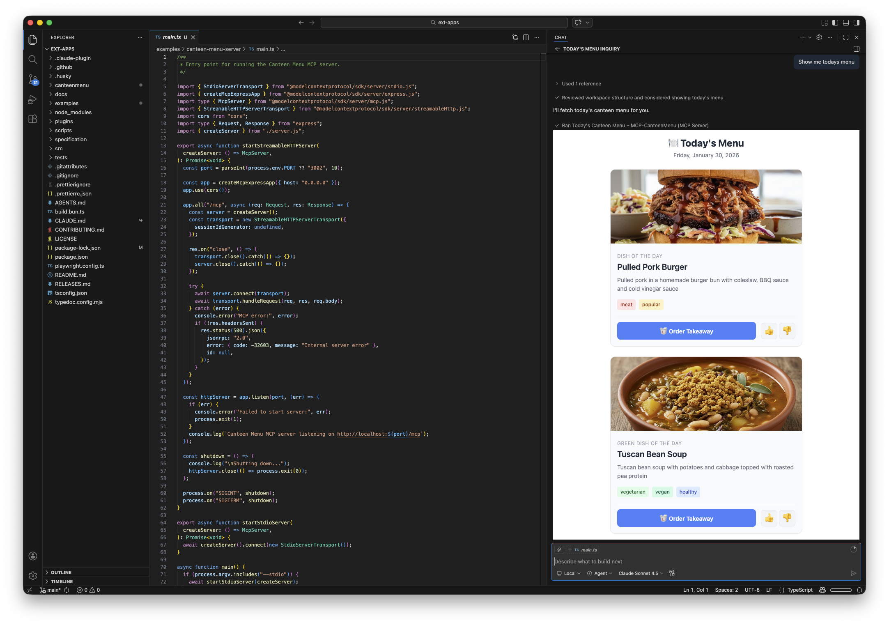

# Canteen Menu MCP App Server

An MCP App that displays today's canteen menu with interactive ordering and reaction features.

_NOTE: This is a DEMO and not feature-complete. It's purpose is to show what you can do with MCP Apps._

## Features

- **Daily menu display** - Shows dish of the day and green dish
- **Food images** - Visual preview of each dish
- **Order takeaway** - One-click ordering for takeaway
- **Reactions** - Give thumbs up 👍 or thumbs down 👎 to dishes
- **Host theme integration** - Adapts to light/dark mode

## Quick Start

```bash
# Install dependencies
npm install

# Build and start
npm run start
```

The server runs at `http://localhost:3002/mcp`.

## Claude Desktop Configuration

Add to `~/Library/Application Support/Claude/claude_desktop_config.json`:

```json
{
  "mcpServers": {
    "canteen-menu": {
      "command": "npx",
      "args": [
        "tsx",
        "/path/to/canteen-menu-server/main.ts",
        "--stdio"
      ]
    }
  }
}
```

## Visual Studio Code

Add to `mcp.json`:

```json
{
	"servers": {
		"MCP-CanteenMenu": {
			"type": "stdio",
			"command": "npx",
			"args": [
				"tsx",
				"/path/to/canteen-menu-server/main.ts",
				"--stdio"
			]
		}
	},
	"inputs": []
}
```




## Development

```bash
npm run dev
```

## License

MIT
